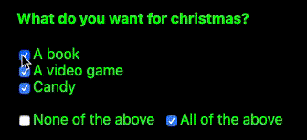

# Grouped Checkboxes
[](https://codecov.io/gh/createnl/grouped-checkboxes)
[](https://travis-ci.org/createnl/grouped-checkboxes)
[](https://github.com/createnl/grouped-checkboxes/blob/master/LICENSE)
[](https://www.npmjs.com/package/@createnl/grouped-checkboxes)
[](https://github.com/facebook/react)

An easy to use React Component to create a checkbox group with a checkbox to check all checkboxes and a checkbox to check none.

## Installation
```
npm install --save @createnl/grouped-checkboxes
```
```
yarn add @createnl/grouped-checkboxes
```

## Example
[](https://v5sww.csb.app/)

Live examples: https://v5sww.csb.app/

Codesandbox: https://codesandbox.io/s/grouped-checkboxes-v5sww

``` jsx harmony
import React from "react";
import { AllCheckerCheckbox, Checkbox, CheckboxGroup } from 'grouped-checkboxes';

const MyGroupedCheckboxes = (props) => {
    const onCheckboxChange = (checkboxes) => {
        console.log(checkboxes);
    }    

    return (
        <CheckboxGroup onChange={onCheckboxChange}>
          <AllCheckerCheckbox />
          <Checkbox value="option-1"/>
          <Checkbox value="option-2" />
          <Checkbox value="option-3" />
        </CheckboxGroup>
    );
};
```
Note that `Checkbox` and `AllCheckerCheckbox` must be inside a `CheckboxGroup`

## Features
- Multiple `AllCheckerCheckboxes` and `NoneCheckerCheckboxes` inside a group
- `onChange` callback on group
- Possibility to nest checkboxes in your own components
- Possibility to check or disable by default
- You can do anything with a `Checkbox` you can do to an `input` component
- Fully Typed

## Advanced examples

### Checking checkboxes
```jsx harmony
<CheckboxGroup defaultChecked> // Set defaultChecked to check all by default
  <AllCheckerCheckbox checked/> // Error: You cant contol allCheckerCheckboxes individually (will check automatically if necessary)
  <Checkbox value="anything" checked/> // Check individual checkboxes
</CheckboxGroup>
```

### Disabling checkboxes
```jsx harmony
<CheckboxGroup defaultDisabled> // Set defaultDisabled to disable all by default
  <AllCheckerCheckbox disabled/> // Disable allCheckerCheckbox, will still check if all checkboxes are checked
  <Checkbox value="anything" disabled/> // Disable individual checkboxes
</CheckboxGroup>
```

### Real life example (with check all)
``` jsx harmony
import React from "react";
import { AllCheckerCheckbox, Checkbox, CheckboxGroup } from 'grouped-checkboxes';

const PermissionsFrom = (props) => {
    const onCheckboxChange = (checkboxes) => {
        console.log(checkboxes);
    }    

    return (
        <CheckboxGroup onChange={console.log}>
          <label>
            <Checkbox value="tos" />
            Terms and Conditions
          </label>
          <label>
            <Checkbox value="privacy-policy" />
            Privacy Policy
          </label>
          <label>
            <Checkbox value="advertisements" />
            Advertisements
          </label>
          <label>
            <AllCheckerCheckbox />
            Agree to all
          </label>
        </CheckboxGroup>
    );
};
```

The value of an onChange parameter looks like:
```json
[
    {
        "checked": true,
        "disabled": false,
        "value": "tos"
    },
    {
        "checked": true,
        "disabled": false,
        "value": "privacy-policy"
    }, 
    {
        "checked": true,
        "disabled": false,
        "value": "advertisements"
    }
]
```
All given props will be accessible.

### Real life example (with none-checker)
If you need a checkbox that will check when nothing is checked you can use the NoneCheckerCheckbox.
This checkbox can be clicked to uncheck everything else, but can't be unchecked to check everything else. 

``` jsx harmony
import React from "react";
import { NoneCheckerCheckbox, Checkbox, CheckboxGroup } from 'grouped-checkboxes';

const LunchDeclaration = (props) => {
    const onCheckboxChange = (checkboxes) => {
        console.log(checkboxes);
    }    

    return (
        <CheckboxGroup onChange={console.log}>
          <h1>What did you eat for lunch?</h1>
          <label>
            <Checkbox value="pizza" />
            Pizza
          </label>
          <label>
            <Checkbox value="burger" />
            Burger
          </label>
          <label>
            <Checkbox value="fries" />
            Fries
          </label>
          <label>
            <NoneCheckerCheckbox />
            Nothing
          </label>
        </CheckboxGroup>
    );
};
```
The value of an onChange parameter looks like:
```json
[
    {
        "checked": true,
        "disabled": false,
        "value": "pizza"
    },
    {
        "checked": true,
        "disabled": false,
        "value": "burger"
    }, 
    {
        "checked": true,
        "disabled": false,
        "value": "fries"
    }
]
```
Note that the value of the NoneCheckerCheckbox will not be passed.
